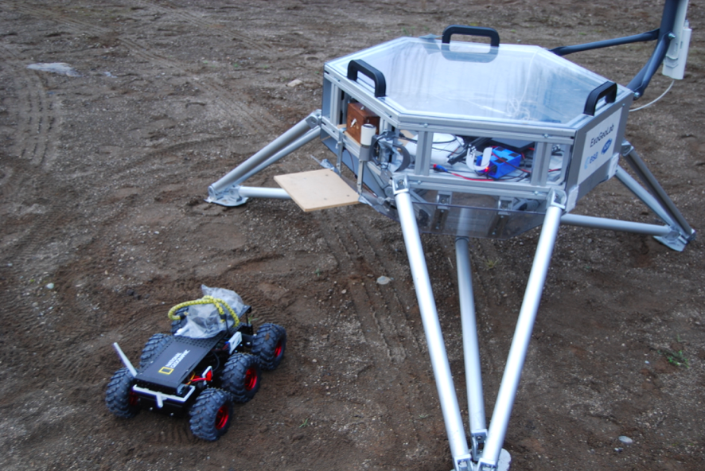
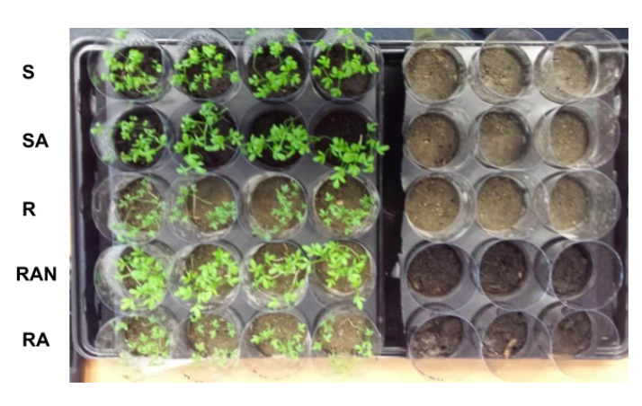
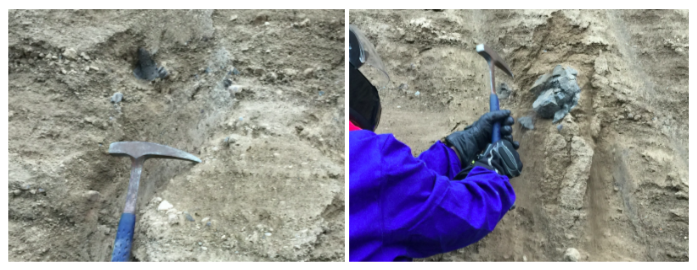
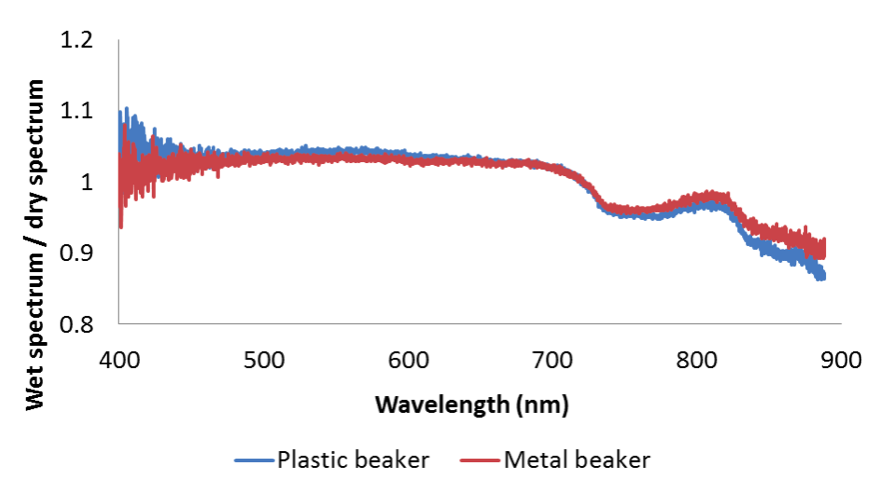
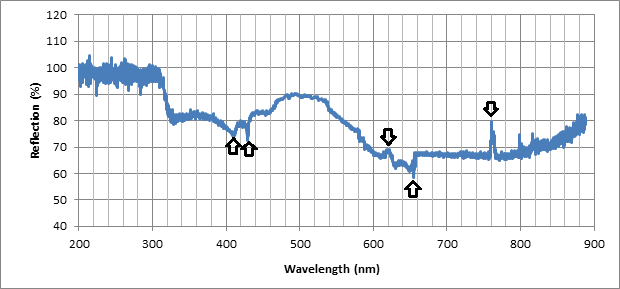

# Geological analog simulation in volcanic region of Eifel, Germany: field spectroscopy, imaging, sampling, laboratory spectroscopy of minerals, water, organics and biomarkers with operational issues during extravehicular activity simulation

## Authors

- H. C. Vos 1, 2, 3
- M. Harasymczuk 1, 2, 3, 7
- A. Kołodziejczyk 1
- M. Krainski 1
- L. Davidová 4, 5
- M. Mirino 1
- A. Casini 6
- J. Vago 1
- B. H. Foing 1, 2, 3
- Eifel ILEWG Euro MoonMars 2016 & 2017 support team
- et al.

1. ESA/ESTEC, Postbus 299, 2200 AG Noordwijk, NL
2. ILEWG
3. Vrije Universiteit Amsterdam
4. Charles University Prague
5. QED GROUP
6. Polytechnic University of Milan
7. University of Warsaw

## Introduction

Analog simulations has a very important role in preparation for space agencies to exploration of another celestial bodies. The main objective is to test procedures, tools and equipment for future use in those cutting-edge projects. As of the Extravehicular Activity (EVA) is the most crucial part of the mission and in fact this is the reason why we're sending human for extraterrestrial voyages we need to put a lot of efforts on communication, timelines, checklists and astronaut training itself.

During the EVA simulations performed in Eifel, Germany region the set of European Space Agency scientists and research collaborators has tested the human-robotic partnership, EVA procedures and schedule for geological sampling of the sedimentary layers in former volcanic activity location.

## Identification of the location

The simulation took place in Eifel volcanic region in the vicinity of Mandig, Germany. The place has been chosen because of the past volcanic activity and rich and yet easy to access sedimentary layers of the geologic samples. The simulation crew has identified two distinct locations that was representative examples to test the human-robotic interactions together with geologic Extravehicular Activity procedures. Professionally trained geologist had chosen suitable place to conduct the analog as soon as the crew arrived at the location of the simulation.

## Description of the activity

During the simulation the crew prepared three distinct Extravehicular Activities. Each one of them had different objectives.

### The first EVA

During the first EVA the main objective was to set-up a remote controlled telescope which was later used to identify interesting and noteworthy objects. Before the first simulation the analog astronaut crew started to prepare for the EVA. In the meantime the engineering crew prepared the lander and remote controlled rover for the deployment and simulated descent and landing on the ground. During the first Extravehicular Activity crew members tasks was:

- identify and take the contingency sample,
- establish and test the radio communication with simple and complex transmission,
- map the vicinity of lander for possible radio communication problems,
- photograph the location of rover and nearby rock wall,
- secure the lander,
- check the wireless connection of the computer systems between lander and habitat,
- setup and calibrate the spectrometry analysis device,
- photograph the location of soil and rock sampling (big picture),
- identify and sample the most interesting elements of the sedimentary layer,
- photograph wtih high precision and detail the rock to outcrop,
- outcrop rock samples and collect in plastic bags, photograph and mark the bags,
- test possibility of the rover to access the rough terrain,
- deliver the rock samples using the rover to the spectrometry analysis device on lander,
- conduct spectrometry analysis from the habitat using remote control,

**Figure 1, Two astronauts and the ILEWG ExoGeoLab lander during an analogue Moon EVA.**

### The second EVA

The second EVA main objective was to secure lander access to the power using solar panels and to do geological field work. Moreover the team had to perform:

- investigate more in-depth details of the sedimentary layers,
- photograph with high resolution camera the field of work,
- outcrop and collect to marked bags the rock samples,
- identify more detailed location for future EVA,
- test the suit for easy of move,
- test the emergency procedure for EVA termination because of solar flare coming.

### Third EVA

Third EVA's main objective was to test rover possibility to perform tasks in extremely rough terrain and for the astronaut Biologist to take ground sample to identify signs of life. This EVA has been performed in the dim light conditions with the limited visibility.

- test rover operations in rough terrain,
- identify and collect biological sample for further analysis,
- test the rover lights,
- test the influence of poor light condition on rover control using video navigation aids,
- test in-the-field rover control using portable antenna and sidearm joystick,
- test radio communication procedures.

## Field spectroscopy, imaging and sampling

Several spectroscopy analyses in the UV/VIS spectrum were performed using the remotely controlled USB4000 spectrometer during a field campaign in the Eifel volcanic area in Germany. The data that was obtained during the field measurements is compared to the spectrum of the same geological sample from analyses done in a laboratory to determine the reliability of field spectroscopy analyses. By determining the errors that can occur during field measurements we hope to establish better conditions for field spectroscopy and a calibration method to minimize these errors for future field measurements.

Background on ExoGeoLab and the Eifel: The field spectroscopy was performed during a campaign following previous ILEWG EuroMoonMars campaigns [1 - 10]. The campaign was done in the Eifel volcanic area in Germany at an outcrop near the Laacher See. The outcrop consisted of volcanic deposits from the Laacher See eruption from approximately 13,000 years ago. During the campaign four analogue Moon Extravehicular Activities (EVAs) were executed. During two of these EVAs an astronaut would collect geological samples and bring them to the lander for spectrometry analyses, see figure 1.

**Figure 1, Two astronauts and the ILEWG ExoGeoLab lander during an analogue Moon EVA.**

### Method

The spectrometer USB4000 was installed on the ILEWG ExoGeoLab lander and controlled remotely, see figure 2. During the field campaign sunlight was used as light source for the spectroscopy measurements. However, a high integration time of 4 to 6 seconds was necessary to reach a usable light intensity. Because of the high integration time a measurement took relatively a lot of time which is why 5 scans to average was applied instead of 10 to 20 scans to average [8]. The high integration time also could have made the analyses more sensitive to changes, such as weather changes. A dark spectrum was measured before the EVA, which means that the dark spectrum could have changed slightly when the analyses was done.

**Fig. 2, ILEWG ExoGeoLab lander with remotely controlled USB4000 spectrometer and rover**

### In Situ results

Figure 3 shows the reference spectrum from the sample analysis and figure 4 shows the spectrum of one of the volcanic rocks that was sampled during the field campaign. This graph shows a number of anomalies that are likely not caused by absorption bands from the sample. A high reflection value around 760 nm and relatively more absorption around 430 nm and 590 nm are examples of such anomalies.

**Figure 3, The reference spectrum that was used to analyse the sample during the field campaign.**

**Fig. 4, The spectrum of a volcanic sample from the Eifel volcanic area measured during a Moon EVA corrected by the reference spectrum from the same measurement.**

### Post campaign measurements

The same that was measured during the Moon analogue mission was also analysed in a laboratory with a strong incandescent light source to prevent light contamination. When comparing the results from the field measurements, both the reference spectrum and the sample reflection, with the laboratory measurements, some differences in the spectrum are visible. These differences can be caused by changes in weather conditions, errors in the reference spectrum and the high integration time.

The measurements will be repeated during a planned field experiment in February 2017 to determine the changes in the spectrum by changing certain parameters. For example, by adding an extra light source near the spectrometer we expect to improve the results from the spectroscopy analyses.

We hope to improve the conditions for the measurements and create a calibration method by being aware of the errors that can occur during field spectroscopy analyses. Spectroscopy analyses in the UV/VIS spectrum is limited in its practical use. However, being aware of the problems that arise during field spectroscopy in this spectrum can also be taken into account during measurements in the NIR and IR spectrum.

## Laboratory spectroscopy of minerals, water, organics and biomarkers

For this study several analyses were done in the UV/VIS spectrum using a USB4000 spectrometer. The focus of these analyses was to determine the detectability of certain elements that are known to influence the UV/VIS spectrum such as transitional metals, but also the influences of minerals, organics and volatiles [11].

### Spectrometer

The USB4000 spectrometer is a relatively small spectrometer. The size makes it mobile and suitable to use in the field and on a lander or a rover. However, there are clear restrictions in using this spectrometer for analyses, the first restriction being the fact that a UV/VIS spectrum gives very restricted information about a surface compared to an infrared spectrum. Also the relatively high amount of noise and systematic effects makes this spectrometer less suitable for precise measurements. One of the minor objectives of this study was to determine what the best conditions are for performing the analysis on this spectrometer as a continuation of earlier research [9]. Examples of such parameters are for example the scans to average, the integration time and the light source.

### Laboratory measurements

The analyses were performed using the USB4000 in a dark environment. The light source was mainly an incandescent lamp. The integration time for the measurements was 100 milliseconds and the number of scans to average was generally 20. A dark spectrum was measured before every sequence and the reference spectrum was determined before every measurement.

Figure 5 shows the results from an analyses whereby the influence of water was measured using a plastic and a metal beaker. The spectrum of the empty beakers and the spectrum of the beakers filled with water were measured, after which the ratios of these spectra were calculated. In both cases there is a clear trend visible that is probably caused by the presence of water. This trend is in accordance with two known water absorption bands at 739 and 836 nm [12]. However, this influence of water is less often visible in minerals and rocks analyses, possibly due to mineral-water interactions, and even though water has also absorption bands in lower wavelengths [12], these are not visible in these graphs.

**Figure 5, The influence of water on the VIS spectrum**

Also the conditions of vegetation can be analysed using the USB4000 spectrometer. An experiment was done using different soil types to determine the influence of the soil and the health of a plant on the spectrum of lepidium sativum (garden cress). Figure 6 shows the results of spectroscopy analyses on plants growing on different soil types. 'S' and 'R' are different soil types whereby 'S' is a 'normal' soil whereas 'R' represent a Moon regolith. 'A' means that organisms were removed from the soil and 'N' means that nutrients have been added to the soil. It can be stated from observations and spectroscopy that the soil, the nutrients and microorganisms influence the spectrum of plants growth.

**Figure 6, The spectrum water cress grown on different soil types 20 days after it was seeded.**

The measurements that were done and planned future measurements can indicate the possibilities and boundaries of this spectrometer and determine the usability of this spectrometer in practice.

## Operational issues of analog Extravehicular Activity

During EVA scenarios team was able to identify several issues. Most of those issues were connected with communication and mission organization. The problems has been reported and elaborated upon to create a lessons learned article. Here's the list of the improvements astronauts team must introduce before the next simulation.

### Communication

- train astronauts with radio communication,
- introduce common linguo and alphabet,
- pre-established radio callsigns and callouts,
- establish protocol for emergency calls,
- introduce radio communication culture,
- introduce protocol for lost communication,
- train crew to communicate intentions befor activity,
- simplify the emergency procedures,
- investigate problems with radio communication hardware.

### Mission Organization

- improve EVA scenarios,
- make more clear the general mission objectives,
- train more people in lander and onboard hardware assembly,
- introduce inventory system and keep your workspace clean culture,
- prevent chaos with spontaneously happen,
- introduce segregated compartments with tools and spare parts,
- log EVA events, timelines, informations,
- keep more organized notes or use IT system support,
- introduce briefings and debriefing.

### Extravehicular Activity

- create a pre-EVA checklist: rock hammer, sample bags, size comparison marker, suit stuff, lightning,
- create a procedure for taking pre- and post-EVA medical measurements,
- maintain in-habitat culture while EVA is in progress,
- shorten the pre-EVA procedure,
- introduce a culture to work in pairs (leading EV1 and supporting EV2),
- document in more detailed manner the field and sample before performing a tasks,
- keep order in things and place things up in the proper places,
- introduce on arm checklist,
- introduce event logging for the habitat crew.

## Wrap-up session

After the simulation crew has been participating in the wrap-up session, in which the following talks were delivered:

- Status Moon Village activities update (B. Foing)
- Spaceship EAC update (A. Cowley)
- MoonMars Base Simulation (A Kolodziejczyk)
- 1year at HiSeas Mars and MAMBA MoonMarsBase project (C. Heinicke)
- MoonWalk (I. Schlacht/J.Rittweger/Can Inellioglu)
- Lunar EVA simulations (M. Harasymczuk)
- MoonMars Simulation Psychology studies (L. Davidova)
- Material and 3D printing studies (EAC)
- Collecting and analysing samples with robots and astronauts (M. Mirino)
- MoonMars analogue sample spectro demo (H. Vos)
- Virtual reality Model study of lunar polar illumination (A. Casini)
- TeleRobotics (M. Krainski)
- Virtual Reality Simulation Game at MoonVillage (E. Tomozei)
- presentation by Spaceship EAC students
- report from ESTEC workshop & Eifel field study

## Acknowledgements

We thank the participants and collaborators for the ILEWG EuroMoonMars Dec 2016 campaign at the Eifel.

## Bibliography

- [1] Foing B. H. et al. (2011) *Special Issue of International Journal of Astrobiology*, 10, IJA.
- [2] Ehrenfreund et al. (2011) *Astrobiology and habitability studies in preparation for future Mars missions: trends from investigating minerals, organics and biota*, IJA 2011, 10 (3), 239
- [3] Stoker C. et al (2011) *Mineralogical, Chemical, Organic & Microbial Properties of Subsurface Soil Cores from Mars Desert Research Station, a Phyllosilicate and Sulfate Rich Mars Analog Site*, IJA 2011, 10 (3), 269
- [4] Kotler et al. (2011). *Analysis of mineral matrices of planetary soils analogs from the Utah Desert*, IJA 2011, 10 (3), 221;
- [5] Groemer G. et al. (2010) *LPSC 41*, Abstract 1680
- [6] Foing B. H. et al. (2014) *LPSC 45*, Abstract 2675
- [7] Foing B. H. et al. (2016) *LPSC 47*, Abstract 2719
- [8] Batenburg P. et al. (2016) *LPSC 47*, Abstract 2798
- [9] Offringa M. S. et al (2016) *LPSC 47*, Abstract 2522
- [10] Kamps O. M. et al (2016) *LPSC 47*, Abstract 2508
- [11] Clark R. N. (1999) *Manual of Remote Sensing*, vol. 3, 3-58
- [12] Pope R. M. and Fry E. S. (1997) *Appl. Opt. 36*, 8710-8723
